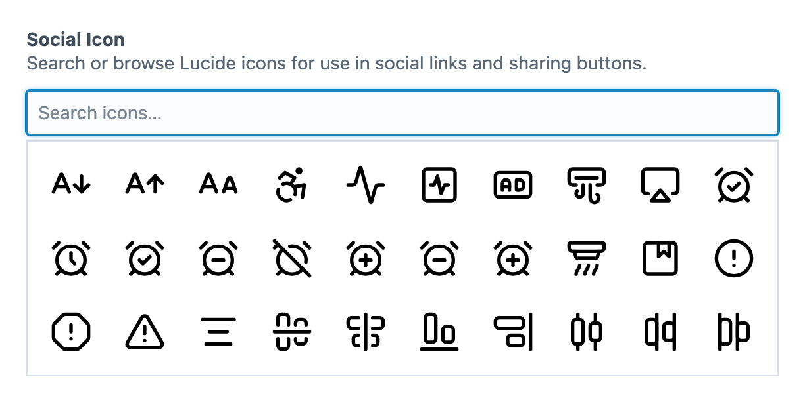

<!-- feature-intro -->
Give content editors an intuitive, visual field for selecting icons without copying filenames or markup. Bring SVGs, sprites, icon fonts and supported remote sets into one consistent Craft workflow.
<!-- feature-intro-end -->

<!-- feature-section media-size="large" media-shadow="false" -->
## Quick search

Search icons quickly by name or browse the available set visually. Each field can expose only the sources that make sense for that part of the site, keeping a large library from becoming a wall of unrelated choices.

<!-- feature-section-end -->

<!-- feature-grid -->
- :icon[file-type-svg] **Individual SVGs** Build a source from standalone SVG files stored by the project.
- :icon[icons] **SVG sprites** Select symbols from an existing SVG sprite sheet.
- :icon[text-size] **Icon fonts** Browse glyphs exposed by the project’s webfont styles.
<!-- feature-grid-end -->

<!-- feature-section -->
## Bring the right icon set

Start with supported catalogues including Bootstrap Icons, Heroicons, Lucide, Material Design Icons, Octicons, Phosphor, Remix Icon and Tabler Icons. Keep project-owned sets organised in nested folders and limit each field to the collections, variants or weights its authors actually need.

<!-- feature-section-end -->

<!-- feature-section -->
## Fast wherever icons appear

Icon sets are cached and lazy-loaded so a substantial library does not weigh down every element edit screen. Selected icons remain useful beyond Twig, with structured GraphQL values, support for Craft element cards and thumbnails, and an integration for projects that still use [Redactor](https://plugins.craftcms.com/redactor).
<!-- feature-section-end -->
